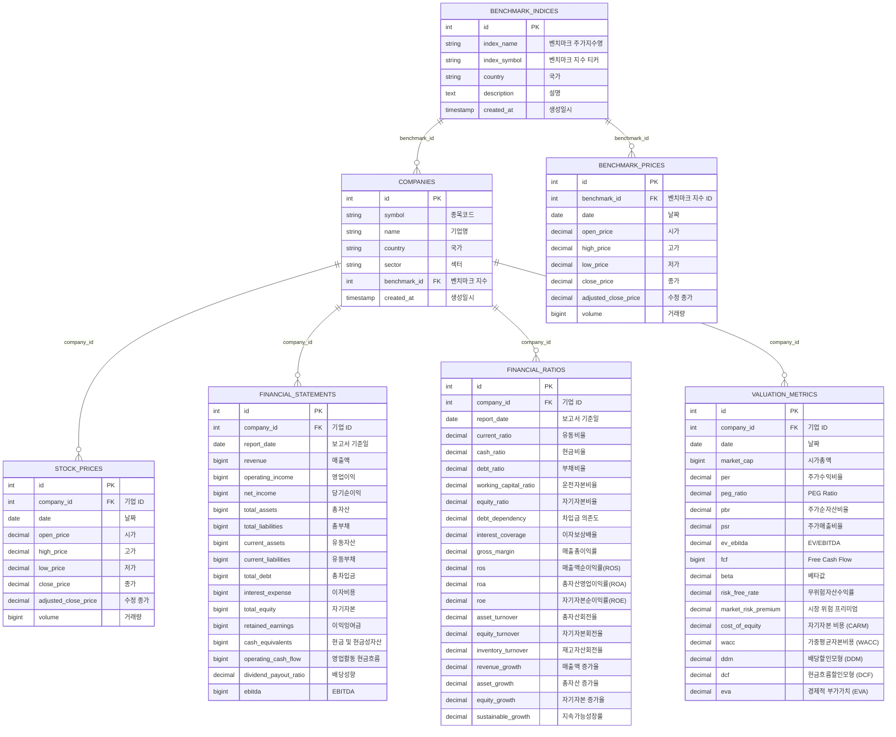

# 기업 데이터 수집

이 프로젝트는 한국 및 미국 기업의 주가 및 재무 데이터를 수집하고,  
재무 분석 및 벨류에이션 모델을 활용하여 기업 가치를 평가하는 시스템입니다.  
주가 데이터는 `yfinance` 및 `pykrx`를 활용하여 수집되며,  
재무 데이터는 `yfinance` 및 `DART API`를 통해 분석 및 저장됩니다.

## 기업 정보 (COMPANIES)

1. ID (인덱스)
2. 종목코드 (Ticker)
3. 기업명
4. 국가 (한국: KR, 미국: US)
5. 섹터
6. 벤치마크 지수 (FK)
    - 한국 : KOSPI, KOSDAQ
    - 미국 : S&P 500, NASDAQ, NYSE
    - 향후 BETA, Risk premium 계산 시 활용
7. 생성일시

---

## 주가 데이터 (STOCK_PRICES)

1. ID (인덱스)
2. 기업 ID (FK)
3. 날짜 (거래일)
4. 시가 (Open Price)
5. 고가 (High Price)
6. 저가 (Low Price)
7. 종가 (Close Price)
8. 수정 종가 (Adjusted Close Price)  
   - 배당 지급 및 주식 분할에 따른 조정 가격
9. 거래량 (Volume)  
   - 특정 거래일의 주식 거래량

---

## 재무 데이터 (FINANCIAL_STATEMENTS)

1. ID (인덱스)
2. 기업 ID (FK)
3. 보고서 기준일 (분기별)
4. 매출액 (Revenue)
5. 영업이익 (Operating Income)
6. 당기순이익 (Net Income)
7. 총자산 (Total Assets)
8. 총부채 (Total Liabilities)
9. 유동자산 (Current Assets)
10. 유동부채 (Current Liabilities)
11. 총차입금 (Total Debt)
12. 이자비용 (Interest Expense)
13. 자기자본 (Total Equity)
14. 이익잉여금 (Retained Earnings)
15. 현금 및 현금성 자산 (Cash Equivalents)
16. 영업활동 현금흐름 (Operating Cash Flow)
17. 배당성향 (Dividend Payout Ratio)
18. EBITDA (Earnings Before Interest, Taxes, Depreciation, and Amortization)

---

## 재무 비율 (FINANCIAL_RATIOS)

1. ID (인덱스)
2. 기업 ID (FK)
3. 보고서 기준일 (분기별)
4. **안정성 지표 (Liquidity & Solvency)**
   - 유동비율 (Current Ratio)
   - 현금비율 (Cash Ratio)
   - 부채비율 (Debt Ratio)
   - 운전자본비율 (Working Capital Ratio)
   - 자기자본비율 (Equity Ratio)
   - 차입금 의존도 (Debt Dependency)
   - 이자보상배율 (Interest Coverage Ratio)
5. **수익성 지표 (Profitability)**
   - 매출총이익률 (Gross Margin)
   - 매출액순이익률 (ROS, Return on Sales)
   - 총자산영업이익률 (ROA, Return on Assets)
   - 자기자본순이익률 (ROE, Return on Equity)
6. **활동성 지표 (Efficiency)**
   - 총자산회전율 (Asset Turnover)
   - 자기자본회전율 (Equity Turnover)
   - 재고자산회전율 (Inventory Turnover)
7. **성장성 지표 (Growth)**
   - 매출액 증가율 (Revenue Growth)
   - 총자산 증가율 (Asset Growth)
   - 자기자본 증가율 (Equity Growth)
   - 지속가능성장률 (Sustainable Growth Rate)

---

## 벨류에이션 지표 (VALUATION_METRICS)

1. ID (인덱스)
2. 기업 ID (FK)
3. 날짜
4. **주가 기반 지표**
   - 시가총액 (Market Cap)
   - 주가수익비율 (PER, Price to Earnings Ratio)
   - PEG Ratio (성장률 고려한 PER)
   - 주가순자산비율 (PBR, Price to Book Ratio)
   - 주가매출비율 (PSR, Price to Sales Ratio)
   - EV/EBITDA (기업가치 대비 EBITDA)
   - 자유현금흐름 (FCF, Free Cash Flow)
5. **리스크 및 비용**
   - 베타값 (Beta)
   - 무위험자산수익률 (Risk-Free Rate)
   - 시장 위험 프리미엄 (Market Risk Premium)
   - 자기자본 비용 (CARM, Cost of Equity)
   - 가중평균자본비용 (WACC, Weighted Average Cost of Capital)
6. **기업가치 평가 모델**
   - 배당할인모형 (DDM, Dividend Discount Model)
   - 현금흐름할인모형 (DCF, Discounted Cash Flow)
   - 경제적 부가가치 (EVA, Economic Value Added)

---

## 벤치마크 지수 (BENCHMARK_INDICES)

1. ID (인덱스)
2. 벤치마크 주가지수명 (Index Name)
3. 벤치마크 지수 티커 (Index Symbol)
4. 국가 (KR, US)
5. 설명 (Index Description)
6. 생성일시

---

## 벤치마크 가격 데이터 (BENCHMARK_PRICES)

1. ID (인덱스)
2. 벤치마크 지수 ID (FK)
3. 날짜 (거래일)
4. 시가 (Open Price)
5. 고가 (High Price)
6. 저가 (Low Price)
7. 종가 (Close Price)
8. 수정 종가 (Adjusted Close Price)  
9. 거래량 (Volume)

---

## ERD



## 트러블슈팅 정리

### 1. 다우존스에서 뉴욕증권거래소(NYSE) 지수로 변경.

다우존스는 주요 산업 30개 주식이지만, 뉴욕증권거래소는 더 많은 주식을 반영할 수 있습니다.

따라서, 데이터베이스의 변화가 필요하지만 다우존스 데이터를 그냥 삭제하면 **FK 제약 조건(Foreign Key Constraint) 문제**가 발생합니다.

**해결방법**

1. 벤치마크 주가 테이블에서 DOW JONES 데이터 삭제
```sql
DELETE FROM BENCHMARK_PRICES 
WHERE benchmark_id = (SELECT id FROM BENCHMARK_INDICES WHERE index_symbol = '^DJI');
```

2. 벤치마크 지수 테이블에서 DOW JONES 삭제
```sql
DELETE FROM BENCHMARK_INDICES WHERE index_symbol = '^DJI';
```

3. 새로운 NYSE 벤치마크 추가
```sql
INSERT INTO BENCHMARK_INDICES (index_name, index_symbol, country, description, created_at) 
VALUES ('NYSE', '^NYSE', 'US', '뉴욕증권거래소(NYSE) 전체 주가지수', NOW());
```

다시 주가 데이터를 다운로드하여 해결

### 2. lxml으로 벤치마크 지수별 티커리스트 확보

lxml은 Python에서 HTML과 XML을 빠르게 처리하는 라이브러리입니다.

S&P 500 티커리스트를 확보하기 위해 위키백과를 사용했고, 다른 지수들은 공식 홈페이지를 활용했습니다.

### 3. KOSPI & KOSDAQ 티커 리스트에 섹터(Sector) 추가(산업 데이터 삭제)

KRX 한국거래소에서 특정 시장(KOSPI/KOSDAQ)의 업종(Sector) 정보 크롤링했습니다.

OTP 요청을 후 KRX 데이터를 다운로드했습니다.

인코딩 후 CSV 파일로 저장 및 업데이트하여 해결했습니다.

산업 데이터의 경우, 국내 기업은 구하기 어려운 관계로 sector로 대체했습니다.

### 4. 주가 및 재무 시계열 데이터 최적화 필요

