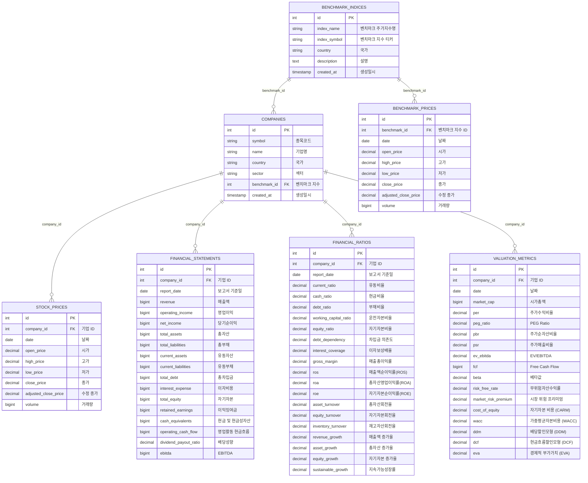

```mermaid
erDiagram
    COMPANIES {
        int id PK
        string symbol "종목코드"
        string name "기업명"
        string country "국가"
        string sector "섹터"
        int benchmark_id FK "벤치마크 지수"
        timestamp created_at "생성일시"
    }
    
    STOCK_PRICES {
        int id PK
        int company_id FK "기업 ID"
        date date "날짜"
        decimal open_price "시가"
        decimal high_price "고가"
        decimal low_price "저가"
        decimal close_price "종가"
        decimal adjusted_close_price "수정 종가"
        bigint volume "거래량"
    }

    FINANCIAL_STATEMENTS {
        int id PK
        int company_id FK "기업 ID"
        date report_date "보고서 기준일"
        bigint revenue "매출액"
        bigint operating_income "영업이익"
        bigint net_income "당기순이익"
        bigint total_assets "총자산"
        bigint total_liabilities "총부채"
        bigint current_assets "유동자산"
        bigint current_liabilities "유동부채"
        bigint total_debt "총차입금"
        bigint interest_expense "이자비용"
        bigint total_equity "자기자본"
        bigint retained_earnings "이익잉여금"
        bigint cash_equivalents "현금 및 현금성자산"
        bigint operating_cash_flow "영업활동 현금흐름"
        decimal dividend_payout_ratio "배당성향"
        bigint ebitda "EBITDA"
    }

    FINANCIAL_RATIOS {
        int id PK
        int company_id FK "기업 ID"
        date report_date "보고서 기준일"
        decimal current_ratio "유동비율"
        decimal cash_ratio "현금비율"
        decimal debt_ratio "부채비율"
        decimal working_capital_ratio "운전자본비율"
        decimal equity_ratio "자기자본비율"
        decimal debt_dependency "차입금 의존도"
        decimal interest_coverage "이자보상배율"
        decimal gross_margin "매출총이익률"
        decimal ros "매출액순이익률(ROS)"
        decimal roa "총자산영업이익률(ROA)"
        decimal roe "자기자본순이익률(ROE)"
        decimal asset_turnover "총자산회전율"
        decimal equity_turnover "자기자본회전율"
        decimal inventory_turnover "재고자산회전율"
        decimal revenue_growth "매출액 증가율"
        decimal asset_growth "총자산 증가율"
        decimal equity_growth "자기자본 증가율"
        decimal sustainable_growth "지속가능성장률"
    }

    VALUATION_METRICS {
        int id PK
        int company_id FK "기업 ID"
        date date "날짜"
        bigint market_cap "시가총액"
        decimal per "주가수익비율"
        decimal peg_ratio "PEG Ratio"
        decimal pbr "주가순자산비율"
        decimal psr "주가매출비율"
        decimal ev_ebitda "EV/EBITDA"
        bigint fcf "Free Cash Flow"
        decimal beta "베타값"
        decimal risk_free_rate "무위험자산수익률"
        decimal market_risk_premium "시장 위험 프리미엄"
        decimal cost_of_equity "자기자본 비용 (CARM)"
        decimal wacc "가중평균자본비용 (WACC)"
        decimal ddm "배당할인모형 (DDM)"
        decimal dcf "현금흐름할인모형 (DCF)"
        decimal eva "경제적 부가가치 (EVA)"
    }

    BENCHMARK_INDICES {
        int id PK
        string index_name "벤치마크 주가지수명"
        string index_symbol "벤치마크 지수 티커"
        string country "국가"
        text description "설명"
        timestamp created_at "생성일시"
    }

    BENCHMARK_PRICES {
        int id PK
        int benchmark_id FK "벤치마크 지수 ID"
        date date "날짜"
        decimal open_price "시가"
        decimal high_price "고가"
        decimal low_price "저가"
        decimal close_price "종가"
        decimal adjusted_close_price "수정 종가"
        bigint volume "거래량"
    }

    BENCHMARK_INDICES ||--o{ COMPANIES : "benchmark_id"
    BENCHMARK_INDICES ||--o{ BENCHMARK_PRICES : "benchmark_id"
    COMPANIES ||--o{ STOCK_PRICES : "company_id"
    COMPANIES ||--o{ FINANCIAL_STATEMENTS : "company_id"
    COMPANIES ||--o{ FINANCIAL_RATIOS : "company_id"
    COMPANIES ||--o{ VALUATION_METRICS : "company_id"
```